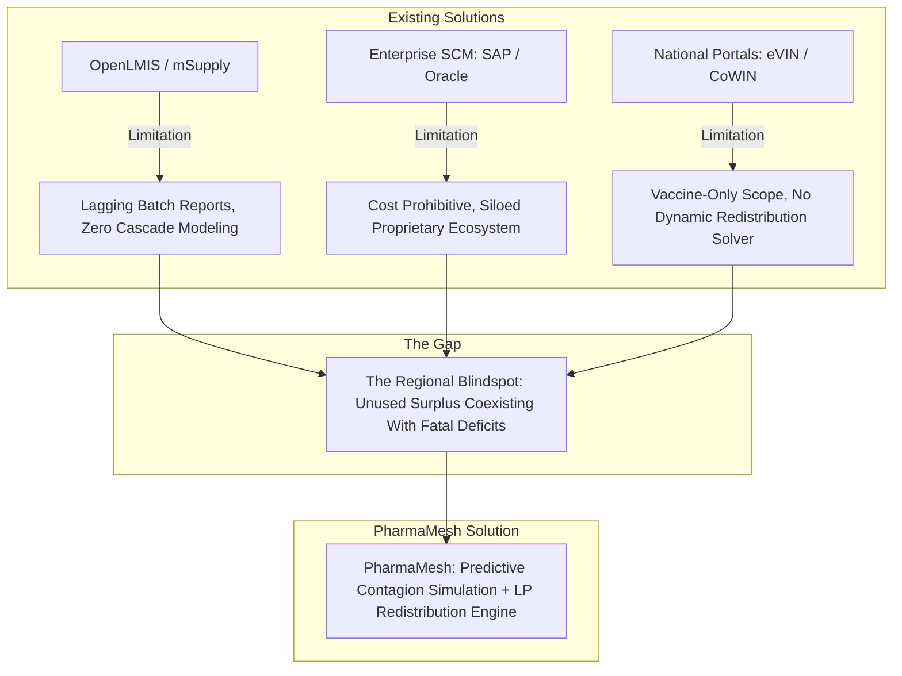
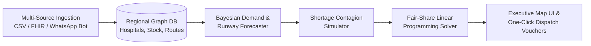

# 🏥 PharmaMesh: Predictive Supply Contagion Engine & Collaborative Redistribution Mesh

**Hackathon Track:** SDG 3 – Good Health and Well-being  
**Event:** Manipal Hackathon  
**Challenge:** "From One Empty Shelf to a Regional Shortage"  
**Document Type:** Strategic Breakdown, Competitive Gap Analysis & System Architecture

---

## 1. Problem Deconstruction

### 1.1 Core Problem Statement
Local stockouts in healthcare facilities are rarely isolated inventory failures—they are **early seismic indicators of systemic regional disruptions**. Driven by the pharmaceutical *bullwhip effect*, asynchronous delivery lead times, erratic patient influx, and geographic constraints, a localized deficit can cascade across neighboring clinics before health authorities can intervene.

Crucially, **regional supply is often misallocated rather than exhausted**: usable surplus sits idle in one facility's storehouse while a clinic 15 kilometers away faces life-threatening stockouts of the exact same essential medicine.

---

### 1.2 Primary Pain Points

* **Siloed Inventory Visibility:** Disparate Hospital Management Information Systems (HMIS), spreadsheets, and legacy ERPs prevent health authorities from getting a unified, real-time demand-supply picture.
* **Lagging vs. Leading Indicators:** Traditional replenishment workflows alert administrators only *after* shelves drop below static minimum levels, eliminating buffer time needed to absorb supplier delays.
* **Contagion & Demand Shifting:** When Facility A runs out of an essential drug (e.g., Ceftriaxone or Insulin), patients migrate to Facilities B and C. This sudden demand shift triggers secondary and tertiary stockouts, cascading into district-wide panics and hoarding.
* **Absence of Autonomous Redistribution:** Health officers lack an automated, constraint-aware operations research engine to solve: *"Which facility can donate surplus without risking its own runway, by which vehicle route, and at lowest transport cost?"*
* **Uncertainty Blindness:** Deterministic spreadsheets fail to account for weather-related logistics delays, outbreak clusters, or supplier stock variations.

---

### 1.3 Target Audience & Stakeholders

| Stakeholder Role | Needs & Objectives |
| :--- | :--- |
| **District / State Health Officers** | High-level regional situational awareness, early contagion warnings, and one-click authorization of regional redistribution orders. |
| **Hospital Chief Pharmacists & SCM Leads** | Accurate Days-of-Stock (DoS) runway projections, automated shortage alerts, and clear surplus donation safety buffers. |
| **Medical Logistics & Fleet Coordinators** | Multi-hop transfer manifests, cold-chain compliant routing, and dynamic ETA tracking. |
| **Emergency Response & Disaster Cells** | Rapid scenario stress-testing (e.g., simulating a 10-day supplier embargo or 40% patient spike). |

---

### 1.4 Ultimate Goal
Design and deploy a **Geo-Aware, AI-Powered Predictive Shortage & Redistribution Platform** that:
1. Models regional healthcare networks as dynamic, interconnected supply-demand graphs.
2. Forecasts multi-facility stockout cascades 7 to 21 days in advance with calibrated uncertainty bounds.
3. Automatically computes optimal, peer-to-peer surplus rebalancing actions using Operations Research (Linear Programming).
4. Provides health authorities with an intuitive, interactive command dashboard to stress-test and avert regional crises.

---

## 2. Existing Solutions & Gap Analysis



### 2.1 Detailed Evaluation Matrix

| Existing Solution / Approach | Architectural Mechanism | Pros | Cons, Limitations & Critical Gaps |
| :--- | :--- | :--- | :--- |
| **1. OpenLMIS & mSupply** *(Global Public Health Logistics)* | Centralized electronic record-keeping of stock issuances, facility consumption, and order requisitions across public health clinics. | • Proven in low-resource environments.<br>• Open-source core with standard health indicators. | • **Lagging Indicators:** Relies on retrospective monthly/weekly summaries rather than real-time consumption velocity.<br>• **Zero Network Cascade Modeling:** Treats facilities as isolated silos.<br>• **No Optimization Solver:** Staff must manually negotiate transfers over phone/email. |
| **2. Enterprise SCM Suites** *(SAP IBP, Oracle Cloud SCM, Manhattan Associates)* | Sophisticated enterprise planning suites linking manufacturer procurement, distribution warehouses, and point-of-sale inventory. | • High throughput.<br>• Robust supply-chain ERP integrations. | • **Prohibitive Cost:** Multi-million-dollar licensing fees; inaccessible for municipal public health agencies.<br>• **Walled Gardens:** Cannot ingest data seamlessly across mixed public PHCs, private hospitals, and independent pharmacies.<br>• **Complex UX:** Steep learning curve unfit for frontline clinic workers. |
| **3. Specialized Portals** *(e.g., India's eVIN / CoWIN, U-WIN)* | IoT temperature-monitored cold-chain portals tracking vaccine ampoules and regional depot distributions. | • Excellent cold-chain IoT hardware integration.<br>• High national uptime. | • **Single-Vertical Scope:** Strictly restricted to immunization schedules, leaving general emergency medicines and oncology drugs unsupported.<br>• **Static Reorder Triggers:** Uses fixed min-max thresholds rather than probabilistic consumption velocity.<br>• **No Autonomous Peer Rebalancing:** Lacks multi-facility optimization algorithms. |

---

## 3. The Winning Solution: `PharmaMesh`

### 3.1 Solution Overview
**`PharmaMesh`** is a **Predictive Supply Contagion & Autonomous Rebalancing Platform**. It treats a cluster of regional healthcare facilities as an interconnected, resilient supply mesh. 

By analyzing real-time consumption velocity, patient referral patterns, road network distances, and replenishment lead times, `PharmaMesh` models inventory depletion as a **dynamic contagion process**. When a facility approaches a critical threshold, the platform runs a **mixed-integer linear programming (MILP) solver** to generate instant peer-to-peer transfer manifests—preventing regional collapse before vendor replenishments arrive.

---

### 3.2 Unique Selling Proposition (USP)
> **"From Predictive Contagion to Prescriptive Rebalancing"**  
> While conventional systems merely report who ran out of stock yesterday, `PharmaMesh` **simulates how a shortage will spread like an infection across neighboring hospitals 14 days into the future**, and **solves the multi-facility rebalancing puzzle with a single-click transfer dispatch**.

---

### 3.3 Core System Features



#### Feature 1: Shortage Contagion Simulator (The "Ripple Effect" Engine)
* **Interactive Disaster Sandbox:** Allows health directors and hackathon judges to inject shock events (e.g., *“Main highway flooded for 5 days”*, *“40% surge in respiratory cases in District 3”*, *“Supplier batch recalled”*).
* **Graph Propagation:** Shows real-time dynamic color shifts on an interactive 3D map as patient demand cascades from an exhausted hospital to neighboring clinics.

#### Feature 2: Bayesian Days-of-Stock (DoS) Runway Forecaster
* **Probabilistic Projections:** Replaces static averages with time-series forecasting (incorporating day-of-week seasonality and surge velocity).
* **Calibrated Uncertainty Bounds:** Communicates risk with transparency (e.g., *"Facility X has a 92% probability of stockout in 4.2 days [95% CI: 3.8 – 4.9 days]"*).

#### Feature 3: Autonomous "Fair-Share" Redistribution Optimizer
* Formulated as a Linear Programming (LP) transport problem:
  $$\min \sum_{i \in S} \sum_{j \in D} \left( c_{ij} \cdot x_{ij} + \mu \cdot \text{RiskPenalty}_j \right)$$
  **Subject to:**
  1. **Donor Safety Constraint:** No donor facility may drop below its guaranteed safety runway ($DoS_i - \frac{\text{Donated}}{\text{Velocity}_i} \ge \tau_{\text{safe}}$).
  2. **Shelf-Life & Cold-Chain Matching:** Medicines nearing expiration are prioritized for high-velocity deficit hospitals.
  3. **Transit Time vs. Urgency:** Transfers arrive before the recipient facility hits zero.

#### Feature 4: "Zero-Friction" Multi-Channel Data Ingestion
* Ingests data via REST API, automated CSV drops, FHIR format, or a lightweight Telegram/WhatsApp conversational bot for remote rural PHCs (e.g., typing *"Add 300 vials Amoxicillin"*).

#### Feature 5: Clinical Criticality Matrix & One-Click Interventions
* Prioritizes interventions based on clinical severity (ICU life-support medications > IV antibiotics > maintenance analgesics).
* Generates downloadable digital dispatch vouchers with QR verification for drivers and receiving pharmacists.

---

## 4. Modern Hackathon Tech Stack

Designed for rapid 24–48 hour prototype assembly with high production quality, exceptional visual polish, and deep technical credibility:

| Architectural Tier | Technology | Purpose & Hackathon Justification |
| :--- | :--- | :--- |
| **Frontend Framework** | **Next.js 14 (App Router) + TypeScript** | High performance, server-side data fetching, and rapid development. |
| **UI Design System** | **Tailwind CSS + shadcn/ui + Lucide Icons** | Ultra-clean dark-mode aesthetics, responsive data tables, accessible dialogs and metric cards. |
| **Interactive Geospatial Map** | **Mapbox GL JS / MapLibre + Deck.gl** | 3D terrain/city view with pulsing red shortage rings and glowing green curved transfer arcs (guaranteed visual wow factor). |
| **Interactive Graph Visualizer** | **React Flow / vis.js** | Visual network topology showing hospital dependency nodes and transfer edges. |
| **Backend API** | **FastAPI (Python 3.11)** | Auto-generated interactive Swagger docs, async endpoints, native interoperability with Python scientific packages. |
| **Operations Research & ML** | **PuLP / SciPy Optimization + NumPy / Pandas** | Legitimate Linear Programming solver for multi-facility stock rebalancing; lightweight time-series forecaster. |
| **Database & Spatial Engine** | **SQLite with SpatiaLite / PostgreSQL + PostGIS** | Fast nearest-neighbor geographic distance calculations (`ST_Distance_Sphere`). |
| **Synthetic Data Engine** | **Faker + Custom Simulation Script** | Pre-generated dataset of 15 hospitals/PHCs in Manipal/Udupi district with 20 essential drugs, historical consumption logs, and simulated supply disruptions. |

---

## 5. Hackathon Winning Presentation Strategy

### 5.1 The 3-Minute Pitch Script Outline
1. **The Hook (0:00 - 0:30):**  
   *"Last year, an ICU in a rural hospital lost patients due to an Amoxicillin shortage. On the exact same afternoon, a district hospital 18 km away had 4,000 vials expiring on its shelves. Why? Because healthcare inventory systems are blind islands."*
2. **The Demo — Cascade in Action (0:30 - 1:30):**  
   * Open the **PharmaMesh Map**. Trigger a simulated supplier delay slider. Watch Hospital A run dry, and witness the yellow warning lights pulse across Hospitals B, C, and D as patient diversion spikes their load.
3. **The Solution — The Redistribution Miracle (1:30 - 2:15):**  
   * Click **"Run Intelligent Rebalancing"**. Within 400 milliseconds, PuLP computes the optimal multi-facility transfer schedule. 
   * Green delivery arcs illuminate the map: surplus is routed along the fastest roads without endangering the donors' safety stock.
4. **The Impact & Viability (2:15 - 3:00):**  
   * Show the mathematical guarantee, zero-friction WhatsApp entry for rural clinics, and alignment with UN SDG 3. End with a memorable closing slogan.

---

## 6. Project Directory Scaffolding (Recommended)

```
Manipal-Hackathon/
├── PHARMAMESH_STRATEGY.md             # This comprehensive strategic document
├── backend/
│   ├── main.py                       # FastAPI application entrypoint
│   ├── config.py                     # App configuration & settings
│   ├── database.py                   # DB connection & models
│   ├── models/
│   │   ├── facility.py               # Hospital / PHC schema
│   │   ├── drug.py                   # Pharmaceutical SKU schema
│   │   └── transfer.py               # Redistribution order schema
│   ├── services/
│   │   ├── simulator.py              # Shortage contagion simulation engine
│   │   ├── forecaster.py             # Bayesian Days-of-Stock predictor
│   │   └── optimizer.py              # PuLP Linear Programming rebalancing solver
│   └── data/
│       └── generate_synthetic_data.py # Realistic Manipal/Udupi healthcare data
└── frontend/
    ├── src/
    │   ├── app/                      # Next.js App Router pages
    │   │   ├── page.tsx              # Executive War Room Dashboard
    │   │   ├── simulator/page.tsx    # Contagion Sandbox & What-If tool
    │   │   └── transfers/page.tsx    # Active Redistribution Dispatches
    │   ├── components/
    │   │   ├── map/GeoSupplyMap.tsx  # Mapbox GL / Deck.gl interactive map
    │   │   ├── analytics/            # Runway charts, forecast ribbons
    │   │   └── ui/                   # shadcn component library
    │   └── lib/                      # API client and helper functions
    ├── package.json
    └── tailwind.config.js
```
