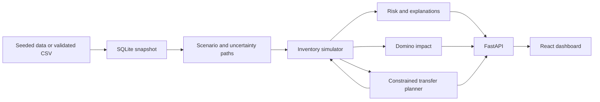

# ShelfWatch — Implementation Plan

**Medicine shortage early warning, regional impact analysis, and safe redistribution**

Version: 1.0 · Prepared 16 September 2026 · Target: a 24–48 hour hackathon

## 1. The product we are building

ShelfWatch helps a district supply coordinator answer four questions:

1. Which facility is likely to run short of which medicine, and when?
2. Which facilities share the same disrupted depot or delivery route?
3. Which transfers would reduce unmet demand without creating a donor shortage?
4. What risk remains after the proposed intervention?

**Pitch:** “ShelfWatch predicts medicine shortages, explains shared supply risks, and compares redistribution plans that protect both receiving and donating facilities.”

The MVP is a decision-support prototype using simulated inventory. It does not prescribe medicines, infer patient diagnoses, dispatch stock, or claim validated clinical outcomes.

### Success criteria

- A visitor can understand a warning, inspect its supporting data, and compare a proposed response within three minutes.
- All forecast charts, map states, recommendations, and outcome metrics come from the same inventory simulation.
- The demo shows one successful intervention and one scenario that cannot be completely solved by redistribution.
- Every transfer has a reproducible quantity calculation, donor check, route, arrival day, and batch allocation.
- Uncertainty and missing data are visible. No arbitrary score is presented as a measured probability.
- The complete demonstration works locally without an account, paid API, or internet connection.

### Chosen scope

| Decision | Default |
|---|---|
| Primary user | District medicine supply coordinator |
| Secondary user | Facility pharmacist reviewing stock and proposed transfers |
| Geography | Fictional facilities positioned around the Udupi–Manipal region |
| Network | 18 facilities, 2 depots, configured supply and transfer routes |
| Products | 5 exact, room-temperature medicine SKUs |
| History | 90 days |
| Forecast | 14 displayed days; 21 internally for reserve checks |
| Simulations | 200 paths, with reproducible seeds |
| Intervention | Direct transfers dispatched at the start of the scenario |
| Presentation | One dashboard with a detail drawer, scenario controls, and plan panel |
| Team assumption | Three contributors familiar with Python and React |

**Out of scope:** patient records, clinical substitution, insulin/cold-chain transfers, actual ordering or dispatch, authentication, live government integrations, patient-referral modelling, fleet routing, multi-hop transfers, deep learning, and chatbot features.

## 2. What differentiates ShelfWatch

### A. Regional risk with explicit mechanisms

A delayed depot changes the arrival dates of its dependent shipments. A closed route blocks eligible deliveries or transfers. Redistribution physically removes stock from one facility and adds it to another after transit.

Geographic proximity alone never increases shortage risk. The map visualizes the results of these mechanisms; it does not generate them.

### B. Domino impact through a counterfactual comparison

Keep the memorable Domino concept, but measure it through paired simulations:

> **Domino impact = regional shortage outcomes with a specified disruption minus outcomes without that disruption.**

For v1, rank the two depots by the effect of adding a seven-day delay to their pending shipments for the selected SKU. Route-closure impact is available in the scenario controls.

Show both the expected number of **additional affected facilities** and **additional unmet units** over seven days. Always display the tested event and horizon next to the result.

A facility stockout does not automatically cause another facility to fail. Facility-to-facility patient redirection would require an additional demand-flow model; do not imply that it exists in this version.

### C. Recommendations with donor protection

Every recommendation shows the recipient benefit, transfer arrival time, donor minimum projected stock, reserve requirement, and remaining uncertainty. If no feasible transfer exists, show the deficit and an escalation recommendation.

### D. Honest explanations

Use computed evidence such as elevated demand, overdue shipments, and shared depot exposure. Allow several factors to coexist. Do not diagnose “panic hoarding” from consumption or show invented confidence percentages.

These are the prototype’s differentiators. No claim is made that existing products lack these capabilities. Earlier live competitor research could not be verified because research access was unavailable.

## 3. Architecture and stack



| Layer | Choice | Implementation rule |
|---|---|---|
| UI | React + TypeScript + Vite | One client application; no server-rendering framework required. |
| Styling | Tailwind CSS | Use a small set of reusable cards, buttons, tables, and drawers. |
| Map | React Leaflet | Local markers and connections; online basemap is optional. |
| Charts | Recharts | Demand history, inventory P10–P90 band, and comparison metrics. |
| API | FastAPI + Pydantic | Typed requests, validation, OpenAPI documentation. |
| Persistence | SQLite + SQLAlchemy | One local database; synchronous writes are sufficient. |
| Analytics | NumPy + pandas | Reproducible simulation and historical summaries. |
| Planner | Custom constrained greedy algorithm | Uses the same simulator; no solver dependency in the MVP. |
| Tests | pytest; Playwright for a few browser smoke tests | Prioritize accounting, allocation, and scenario behaviour. |

Use Python 3.11+ and a supported Node.js LTS release. Resolve mutually compatible maintained package releases at setup, commit the JavaScript lockfile, and freeze the Python environment. Do not copy an old framework version simply because it appears in a previous plan.

OR-Tools can later replace the greedy planner if evaluation demonstrates a useful gap. Do not spend hackathon time maintaining two production planners. NetworkX is unnecessary for the small explicit edge tables.

### Recommended repository layout

```text
shelfwatch/
  backend/
    app/
      main.py
      schemas.py
      database.py
      data/                 # generator and CSV validation
      services/
        forecast.py         # demand and shipment paths
        simulator.py        # the only inventory accounting engine
        planner.py          # donor-safe greedy allocation
        impact.py           # paired depot/route experiments
        explanations.py     # deterministic evidence templates
    tests/
    requirements.txt
  frontend/
    src/
      components/           # map, facility drawer, plan and scenario panels
      lib/                  # API client and shared response types
      App.tsx
    package.json
  fixtures/                 # named deterministic input scenarios
  docs/                     # demo script, metric definitions, assumptions
  README.md
```

Backend services must be callable without HTTP. The API handles input/output; it must not contain a separate version of the analytical logic.

## 4. Data model and simulation fixtures

### Canonical records

| Record | Minimum fields |
|---|---|
| Facility | `id`, `name`, `type`, `lat`, `lon`, `depot_id`, `is_simulated` |
| Depot | `id`, `name`, `lat`, `lon` |
| Product | `sku_id`, `generic_name`, `strength`, `dosage_form`, `base_unit`, `storage_class` |
| Stock batch | `batch_id`, `facility_id`, `sku_id`, `usable_units`, `expires_on`, `observed_at` |
| Daily history | `facility_id`, `sku_id`, `date`, `requested_units`, `fulfilled_units`, `opening_units`, `received_units`, `expired_units`, `closing_units` |
| Shipment | `id`, `depot_id`, `facility_id`, `sku_id`, `batch_id`, `quantity_units`, `promised_arrival_day`, `current_eta_day`, `expires_on`, `status` |
| Historical delivery | `depot_id`, `promised_date`, `actual_date` |
| Route | `id`, `from_id`, `to_id`, `kind`, `distance_km`, `transit_days`, `enabled` |
| Scenario | `id`, `snapshot_id`, `as_of`, `seed`, `assumptions`, `revision` |
| Plan | `id`, `scenario_id`, `scenario_revision`, `status`, `transfers`, `metrics`, `constraint_checks` |
| Review event | `plan_id`, `action`, `reason`, `timestamp` |

`requested_units` may be null when actual demand is unknown. The other unit fields are non-negative integers. Use one canonical unit per exact SKU; no automatic strength, pack-size, or brand conversions.

A shipment’s `current_eta_day` is the best available estimate relative to the scenario. Keep the original promise for the overdue explanation. A cancelled shipment contributes no future receipts; a received shipment is already in the snapshot and must not be received again.

For stock charts, historical ledger rows must balance. For future inventory, batch records are authoritative.

### Five demo products

- Amoxicillin 500 mg capsule — units: capsules.
- Paracetamol 500 mg tablet — units: tablets.
- ORS sachet for 1 litre — units: sachets; one fixed demo formulation.
- Metformin 500 mg tablet — units: tablets.
- Cetirizine 10 mg tablet — units: tablets.

These are supply-model examples, not treatment recommendations. Store exact labels and product IDs. Do not pool medicine quantities into a cross-product “patient impact” score.

### Generator requirements

- Generate 90 × 18 × 5 = 8,100 history rows, plus batches, shipments, and routes.
- Use fictional facility names and clearly label all coordinates and operating records as simulated.
- Generate requested demand first, then derive fulfillment from available stock. Preserve unmet demand rather than hiding it through a stock-at-zero clamp.
- Include weekday variation and moderate random variation, with parameters chosen for a demo rather than described as measured local healthcare behaviour.
- Generate depot delivery histories and shared delay events.
- Use separate fixed seeds for history, evaluation scenarios, and presentation fixtures.
- Keep injected shock labels outside forecast inputs. They are test ground truth, not a shortcut to prediction.
- Make every named fixture reproducible. Do not force a desired impact ranking or outcome into analytical output.

### Fixture set

1. Healthy supply: no shortage and no transfer required.
2. Delayed shared depot: several facilities lose timely replenishment.
3. Demand increase: one facility’s requested demand rises.
4. Mixed pressure: both demand increase and delivery delay.
5. No safe donors: redistribution cannot close the gap.
6. Expiry trap: apparent stock includes batches that become unusable too soon.
7. Closed route: a previously useful transfer is unavailable.
8. Incomplete records: stale stock or insufficient demand history.

## 5. Inventory simulator: the source of truth

### Time convention

- The historical snapshot closes at the end of the preceding day.
- Day 0 is the next morning, before today’s demand.
- Planner transfers leave immediately on day 0, using only eligible snapshot stock.
- Transfer transit is an integer number of days, minimum one day in the demo.
- Supplier receipts and transfer arrivals are available before that day’s demand.
- A batch is usable through its `expires_on` date; remove it before demand on the following date. This is the demo’s explicit date convention.

### Daily order of events

1. Remove expired stock at facilities and in transit.
2. Receive eligible supplier shipments and transfer arrivals.
3. Allocate stock to requested demand using first-expiring-first-out (FEFO).
4. Record fulfilled demand, unmet demand, closing stock, and any expiry.

The initial dispatch occurs before this loop and before day-0 receipts. It removes specific donor batch quantities and creates in-transit records. Transfers never appear at the recipient on approval or dispatch alone.

### Accounting

```text
available = opening stock − expired units + valid receipts + transfer arrivals − dispatched units
fulfilled = min(requested demand, available)
unmet = requested demand − fulfilled
closing = available − fulfilled
```

Here, opening stock is measured before that day's expiry removal and any day-0 dispatch. Expired units are subtracted exactly once, before demand can be served. In the batch implementation, record dispatch separately and reconcile its ledger entry to this daily identity; do not subtract it again from an already adjusted balance.

Maintain this network invariant for each SKU:

> Opening facility and in-transit stock + external receipts = closing facility and in-transit stock + fulfilled demand + expired units.

Requested demand is not subtracted when it cannot be served. Transfers are internal movements and never count as external receipts.

### Service interfaces

```text
generate_paths(snapshot, scenario) -> DemandPaths, ShipmentPaths
simulate(snapshot, paths, transfers=[]) -> SimulationResult
build_plan(snapshot, scenario, paths) -> Plan
compare_plans(snapshot, paths, plans) -> Comparison
compute_impact(snapshot, scenario, paths, disruption) -> ImpactResult
```

Simulation results include per-day stock, fulfilled and unmet units, expiry, first shortfall day, and aggregate metrics. Return batch-level trace details for tests and recommendation checks, not for every chart request.

Use identical underlying random paths when comparing no action, a transfer plan, and a counterfactual disruption. Scenario edits change only their specified assumptions.

## 6. Forecasts, evidence, and uncertainty

### Demand baseline

Use the latest 28 days of known requested demand before `as_of`. Do not include the target day or future fixture values.

For each weekday, use a smoothed mean:

```text
weekday_mean = (sum of that weekday’s observations + 3 × overall_mean)
               / (number of that weekday’s observations + 3)
```

Estimate multiplicative residuals as actual requested demand divided by its smoothed weekday mean. Sample these residuals with replacement for future days, multiply by the future weekday mean and explicit scenario multiplier, round to integer units, and clamp at zero.

Use 200 paths, each 21 days long. The final seven days support forward reserve checks; only the first 14 are shown in the main charts. Independent residual sampling is a simple demo assumption and may miss multi-day demand correlation; say so in the assumptions panel.

### Sparse or censored demand

- Require at least 21 known-demand observations in the latest 28 days for the default estimator.
- Fulfilled quantities from stockout days do not establish requested demand. Keep those observations unknown unless unmet requests were captured separately.
- If history is insufficient, show “insufficient demand evidence,” with no reassuring risk percentage and no automatic donor eligibility.
- If all known demand is zero, show “no observed demand”; do not show infinite days of cover or allow an automatic donation. A future production workflow can supply a reviewed planning baseline.
- If stock is more than 24 hours older than the scenario’s `as_of`, show a stale-stock warning and exclude it from automatic transfers. Compare against scenario time, not the laptop’s current date.

### Replenishment uncertainty

For each depot and simulation path, sample one non-negative delay from its historical late-delivery distribution. Apply that same delay to all of its pending shipments in that path. This represents a shared disruption, not independent coin flips at each hospital.

Sample total non-negative lateness relative to the original promise. For each pending shipment use `arrival_day = max(current_eta_day, promised_arrival_day + sampled_depot_lateness) + explicit_scenario_extra_days`. This respects an already known delay without adding that delay twice. Reject negative current ETA offsets for pending shipments until a current estimate is supplied. Historical delay tails may miss further deterioration beyond a revised ETA; the what-if delay makes that uncertainty explicit.

If fewer than five completed deliveries are available, use the declared demo delay set `[0, 1, 3]` days with equal frequency and label it an assumption. A closed supplier route suspends the affected receipt through the horizon; a closed transfer route makes that transfer unavailable.

Demand multipliers and extra delays entered in the what-if panel are scenario assumptions, not model discoveries.

### What the UI displays

- Seven-day and fourteen-day shortage probability: fraction of paths with unmet demand in that period.
- Expected unmet units and expected facility-days with unmet demand.
- Per-day inventory P10, P50, and P90 values, including the zero-stock paths.
- First-shortfall-day percentiles, using all paths. Treat no shortfall as beyond the horizon and use discrete quantiles; do not remove those paths or interpolate them into invented dates.
- Data freshness, sample size, and assumption flags separately from risk.

For days until shortfall, P10 is earlier and P90 later. P50 is the median. Inventory quantile bands are pointwise summaries, not a single realizable trajectory or a validated confidence interval for real-world performance.

### Summary risk states

| State | Definition |
|---|---|
| Unknown | Required stock or demand evidence is insufficient/stale. |
| Empty | Current usable stock is zero and positive demand is expected. |
| High risk | Fourteen-day model-estimated shortfall probability ≥ 50%. |
| Watch | Probability ≥ 20% and < 50%. |
| Lower risk | Probability < 20%. |

These are configurable demonstration thresholds, not healthcare standards. Show text/icons as well as colours.

### Contributing-factor rules

- **Demand elevated:** latest seven-day known-demand mean is at least 1.5× the preceding 21-day mean, when both windows have complete observations and the earlier mean is positive.
- **Replenishment overdue:** a pending shipment’s promised date precedes `as_of`; report days overdue and the current ETA.
- **Shared depot exposure:** another facility for the same SKU depends on the same affected depot.
- **Insufficient coverage:** projected unmet demand occurs before the relevant receipt.
- **Persistent imbalance:** in a complete 28-day window, fulfilled demand exceeds receipts and stock declined; describe this observation without declaring its root cause.

Return all applicable reasons, ordered with current/near-term shortfall first, overdue delivery second, demand increase third, and other context after that. Show at most three initially, with the remainder expandable.

Do not assign a percentage “confidence” to these rules. Do not call them causal attribution or diagnose hoarding. CUSUM can be explored after the core build, but is not required for v1.

## 7. Domino impact calculation

For the selected SKU:

1. Run the current baseline without transfers for seven days.
2. For each depot, add seven days to every pending receipt it supplies; keep other inputs and random draws fixed.
3. For every path, identify facilities with unmet demand in the disrupted run that had none in the baseline.
4. Report the mean additional-facility count, its P10–P90 range, and the mean increase in unmet units.
5. Rank by mean additional unmet units, then additional-facility count, then depot ID.

Example label:

> “If Depot North’s pending shipments are delayed by seven more days, this model projects 2.4 additional facilities with unmet demand during the next seven days.”

Do not round 2.4 to an asserted “three hospitals will fail.” Show the named assumption and the simulation range.

If a facility was already short, it is not a new affected facility, but its additional unmet units still count. If a depot delay has no effect within the horizon, report zero. Do not force a dramatic ranking.

This is scenario impact, not a permanent property of the depot or proof of real-world causality. It changes with stock, demand, shipments, and the tested disruption.

## 8. Transfer planning algorithm

### Scope and objective

Plan for one exact SKU at a time. Multiple-SKU plans are independent; vehicle capacities and cross-product transport budgets are not modelled.

The MVP uses a deterministic constrained greedy heuristic. Its objective is to reduce projected unmet units while protecting donors, with urgency and arrival time guiding allocation. Do not call it globally optimal.

### Planning stress case

Create a conservative planning trajectory using per-day P80 demand and P80 shipment delays from the generated paths. This is a stress case, not a joint “80% certainty” guarantee.

Define each donor’s required reserve after day `t` as the sum of its planning demand for days `t+1` through `t+7`. Generate through day 20 so the reserve is defined after every displayed day.

All recipients and donors are identified from the no-transfer planning trajectory. A recipient is a facility with projected unmet demand in the first 14 days. A donor must have adequate data and remain above its reserve on every day of the planning horizon after any donation. Donor and recipient sets are disjoint for that SKU.

### Hard constraints

- Exact SKU and base-unit match; room-temperature eligible product.
- Positive integer quantities and valid donor batch allocations.
- An enabled directed route with known transit duration.
- No transfer from stock that will expire before arrival.
- No allocation beyond the donor’s uncommitted, usable snapshot stock.
- Donor closing stock remains at or above its next-seven-day reserve throughout the planning stress case.
- Under each of the 200 evaluation paths, the donor’s cumulative unmet units through each day must not exceed its no-transfer baseline.
- No forwarding incoming transfers, no cycles, and no same-facility transfer.

The path check provides evidence within the sampled scenarios, not an absolute real-world safety guarantee. Show the reserve and demand assumptions beside the result.

### Allocation procedure

1. Sort recipients by earliest planning shortfall day, then highest planning unmet units, then facility ID.
2. For each recipient, enumerate enabled incoming donor routes. Simulate arrivals using each route’s actual transit days.
3. For each donor, use integer binary search to find the maximum total donation that passes the reserve and sampled-path checks. Subtract already committed allocations before considering the next transfer.
4. Allocate candidate donor batches FEFO, excluding batches that expire before arrival. Simulate the recipient to calculate the reduction in unmet units over 14 days.
5. Rank candidates by greatest reduction in unmet units, then earlier arrival, then shorter distance, then donor ID.
6. For the best candidate, find the smallest integer quantity that achieves its maximum available reduction. This avoids moving units that do not improve the projected outcome.
7. Commit that allocation in the temporary plan, update both ledgers, and repeat until the recipient has no planning shortfall or no beneficial candidate remains.
8. Continue to the next recipient. Never reset donor commitments between recipients.
9. Re-simulate the full plan across the paired paths. Verify all constraints and metrics before returning it.

Binary search operates on monotone inventory/reserve constraints with a fixed FEFO batch selection order. Unit tests must verify this property against exhaustive search on small fixtures.

If a route arrives too late to prevent the first shortfall but reduces later unmet demand, retain that limited benefit and explicitly report the earlier shortage. If no feasible candidate remains, return the residual deficit and “additional replenishment required.”

### Recommendation payload

```json
{
  "from_facility_id": "F-B",
  "to_facility_id": "F-A",
  "sku_id": "AMX500_CAP",
  "quantity_units": 100,
  "route_id": "B_TO_A",
  "dispatch_day": 0,
  "arrival_day": 1,
  "batch_allocations": [{"batch_id": "B-AMX-01", "quantity_units": 100}],
  "planning_unmet_units_avoided": 100,
  "donor_minimum_planning_stock": 235,
  "donor_reserve_at_minimum_day": 175,
  "sampled_donor_harm_paths": 0,
  "status": "DRAFT"
}
```

The donor minimum in this example is evaluated for the complete fixture plan, including the additional 40-unit transfer to Facility C. API explanations must state when a donor check is plan-wide.

### Approval and modification

- Draft plans are hypothetical. Approval records a review event; it does not change source inventory or imply real dispatch.
- Comparison charts apply transfers in a simulated branch regardless of approval status.
- “Modify quantity” creates a revised draft and revalidates the entire plan. It is not a client-side edit to a cached recommendation.
- Scenario changes create a new revision. An approval for an older revision is rejected as stale.
- Only one plan is the selected approved proposal for a scenario revision; repeated identical approval requests are idempotent.

## 9. Outcome comparison and metrics

Compare three policies on identical demand and supply paths:

1. No intervention.
2. Nearest eligible donor: same recipient order, stock constraints, batch checks, and minimum-useful quantity logic, but donors ordered by distance.
3. ShelfWatch: candidates ordered by projected shortage reduction, arrival, and distance.

Keep the nearest-donor comparator safe. Do not make it reckless to manufacture an advantage. ShelfWatch may tie or lose on some fixtures; show the measured result.

| Metric | Definition |
|---|---|
| Expected unmet units | Mean sum of requested minus fulfilled units over the displayed horizon. |
| Expected facility-days with unmet demand | Mean count of facility/day pairs with a positive deficit. |
| Expected additional donor unmet units | Mean donor unmet units with plan minus its paired no-action result. |
| Expected expiry units | Mean expired units at facilities and in transit. |
| Transfer units | Actual planned integer units moved. |
| Transfer distance | Sum of configured route distances per shipment, not real vehicle kilometres. |
| Plan latency | Measured backend calculation time. |

Report metrics per SKU. Avoid “regional health score,” “patients saved,” and a cross-product sum that treats a capsule as equivalent to an ORS sachet.

## 10. Backend API and persistence

Prefix endpoints with `/api`. Dates/times use ISO 8601; scenario days are explicit integers. Include `scenario_id`, `revision`, `sku_id`, and `horizon_days` in analytical responses.

| Endpoint | Method | Contract |
|---|---|---|
| `/health` | GET | API readiness and schema version. |
| `/demo/fixtures` | GET | Available named fixture metadata. |
| `/scenarios` | POST | Create from a fixture or imported snapshot, seed, and assumptions. |
| `/scenarios/{id}` | GET | Scenario metadata, facilities, products, routes, and freshness. |
| `/scenarios/{id}` | PATCH | Replace assumptions with an expected revision; append a new revision and invalidate prior current results. |
| `/scenarios/{id}/run` | POST | Compute/cache forecasts and baseline metrics for a selected SKU. |
| `/scenarios/{id}/facilities/{facility_id}` | GET | Historical demand, projected stock, shortfall risk, and evidence. |
| `/scenarios/{id}/impact` | POST | Run the paired depot-delay experiments. |
| `/scenarios/{id}/plans` | POST | Generate ShelfWatch and nearest-donor plans and comparison metrics. |
| `/plans/{id}` | GET | Full transfers, constraints, comparisons, and review status. |
| `/plans/{id}/revisions` | POST | Request changed quantities; return a newly validated draft or errors. |
| `/plans/{id}/review` | POST | Approve/reject with expected scenario revision and optional reason. |
| `/imports/validate` | POST | Validate CSV bundle without replacing a snapshot; 48-hour scope. |
| `/imports/{validation_id}/commit` | POST | Atomically create a snapshot from a valid bundle; 48-hour scope. |

### Scenario input

```json
{
  "fixture_id": "shared_depot_delay",
  "seed": 42,
  "horizon_days": 14,
  "demand_overrides": [
    {"facility_id": "F-A", "sku_id": "AMX500_CAP", "multiplier": 2.0,
     "start_day": 0, "end_day": 13}
  ],
  "depot_delays": [{"depot_id": "DEPOT-N", "extra_days": 7}],
  "closed_route_ids": []
}
```

Allow demand multipliers from 0 through 3, delay additions from 0 through 14 days, and known entity IDs only. Extend an override through internal reserve days when its end day reaches the displayed horizon; document this continuation in the assumptions panel. Otherwise it ends on the stated day.

Scenario creation starts at revision 1. Store each revision's assumptions immutably, keyed by scenario ID and revision; reads default to the current revision and accept an explicit revision for historical inspection. Patching preserves the seed unless it is explicitly changed. Old plans remain inspectable but cannot be approved for the new revision.

Unknown entities return 404; malformed or incompatible inputs return 422 with field errors; outdated edit or review revisions return 409. Computational failures return an explicit error, never an all-zero “safe” result.

Use a process-local cache keyed by snapshot ID, normalized scenario assumptions, SKU, seed, algorithm version, and plan contents. Keep the 24-hour build synchronous and benchmark it before adding worker infrastructure. Disable Run while its request is pending and discard responses for obsolete frontend scenario revisions.

### CSV import, if building through hour 48

Require facilities, products, batches, history, shipments, and routes with the canonical fields above. Depot and historical-delivery files are required unless an explicit assumed delay distribution is supplied.

Check foreign keys, duplicate IDs/rows, integer units, negative values, date order, stale observations, history reconciliation, and requested-versus-fulfilled consistency. Pending batches and route references must match the catalogue. Keep expired stock visible in validation and exclude it from usable quantities; never silently count it as available.

Return row-level errors and a summary. Commit only a valid, complete bundle in a transaction. Do not overwrite the demo fixtures or edit an existing snapshot.

## 11. Frontend behaviour

### One dashboard, four areas

**Top bar:** ShelfWatch name, “Simulated data” badge, selected medicine, scenario name, as-of date, and last run status.

**Main map:** facility states, two depot markers, optional supply connections, and proposed transfer connections. The map switches between “no action” and “with plan” at a selected day. The legend and a table provide the same information without relying on colour.

**Facility drawer:** current usable units, data quality, historical requested demand, inventory forecast band, receipts, shortage timing, and contributing-factor evidence.

**Scenario/plan panel:** demand multiplier, depot delay, route closure, Run button, three-policy comparison, transfer cards, residual shortfall, and simulated review actions.

Place the Domino depot ranking below the summary cards; no separate impact screen is required.

### Interaction rules

- Controls edit a draft scenario; calculations run only on an explicit Run click.
- Distinguish current stock, future median stock, and probability of shortage. A selected future map day must show the relevant scenario/day in its heading.
- A day’s map colour is based on the probability of positive unmet demand on that day; the summary badge uses the documented fourteen-day risk. Label these differently.
- Use “Lower risk,” not “safe.” Unknown data remains visibly distinct.
- Show reason values from the API, not independently calculated frontend logic.
- Display remaining unmet demand even after plan approval.
- Keep keyboard access, visible focus, labelled controls, and reduced-motion support. Animation is optional and never conveys the only explanation.
- Build a desktop layout first and a stacked narrow-screen layout second. Avoid five page routes and elaborate transition effects.

### Offline presentation

Bundle a simple illustrative district schematic or blank coordinate grid with facility/depot markers as the default background. It must not be presented as a navigable road map.

Allow online OpenStreetMap tiles as an optional view with attribution. Standard online tiles are not an offline map; do not bulk-download them. Configured travel durations remain simulated and are not computed from straight-line distance.

When backend work is pending, retain the previous result with a visible “recalculating” state. If a run fails, preserve the last successful result and show the failure; do not silently display stale results as current.

## 12. Verified numerical demo fixture

This deterministic fixture tests accounting and the presentation story. It is deliberately separate from stochastic forecast evaluation. All batches remain usable through the horizon, all routes below take one day, and demand has no random variation.

### Inputs

| Facility | Opening units | Daily requested units | Next receipt |
|---|---:|---:|---|
| A | 60 | 20 | 240 units on day 8 from Depot North |
| B | 500 | 25 | 250 units on day 5 from Depot South |
| C | 120 | 20 | 240 units on day 8 from Depot North |

The base scenario has A and C receiving on day 2. The disrupted scenario adds six days to Depot North, moving both receipts to day 8. B’s delivery remains unchanged.

Enable routes B→A and B→C. Other facilities are excluded from this unit fixture. Set the donor reserve to seven days: B must retain at least 175 units after each day’s demand.

### Expected result after the depot delay

| Measure | No action | ShelfWatch plan |
|---|---:|---:|
| A unmet units over 14 days | 100 | 0 |
| C unmet units over 14 days | 40 | 0 |
| B unmet units | 0 | 0 |
| Facility-days with unmet demand | 7 | 0 |
| Total units transferred | 0 | 140 |
| B minimum daily closing stock | 375 | 235 |

Plan: transfer **100 units from B to A** and **40 from B to C**, departing on day 0 and arriving before day-1 demand.

At the end of day 4, B holds 235 units, above its 175-unit reserve. Its replenishment arrives on day 5. The planner must calculate these values rather than return them from a fixture-specific rule.

The largest total donation B can make under this fixture’s reserve constraints is 200 units: its day-4 closing stock becomes exactly 175. A donation of 201 leaves 174 and must fail validation.

### Stress tests for the live demonstration

- **Double A’s demand to 40 units/day:** over 14 days, no action leaves 300 units unmet across A and C. B’s donation limit remains 200. Allocating those 200 to the earliest-shortfall recipient A leaves 100 units unmet across A and C. The system must report the unresolved gap.
- **Close B→A:** B→C can still transfer 40 units. A retains 100 unmet units; the plan must not draw a fictional alternate route.
- **Restore Depot North’s original day-2 receipts:** A and C do not run short in this fixture and no transfers are needed.
- **Domino demonstration from the restored baseline:** add the standard seven-day disruption to Depot North, moving day-2 receipts to day 9. Within the first seven days, A has 80 unmet units and C has 20. Report two additional affected facilities and 100 additional unmet units. Run this experiment from the normal baseline, not from the already disrupted scenario where both facilities are already short.

The main transfer arithmetic and the two stress-test totals were checked independently during preparation of this plan. This is verification of the fixture specification, not a claim that the application has already been built or tested.

## 13. Build schedule and ownership

### First 24 hours: complete vertical slice

| Time | Work | Exit condition |
|---|---|---|
| 0–2 h | Agree canonical units, schemas, scenario inputs, and the deterministic fixture. Scaffold frontend/API. | Backend/frontend exchange a typed example response. |
| 2–6 h | Build batch-aware simulator, generator, and conservation tests. Build dashboard with fixture JSON. | Deterministic accounting and shortage tests pass. |
| 6–10 h | Add demand/delay paths, risk summaries, and explanation rules. Wire map and detail drawer. | One end-to-end scenario displays calculated uncertainty. |
| 10–15 h | Implement donor caps, greedy allocation, and plan-wide checks. | Verified fixture produces 100 + 40 units; unsafe 201-unit donation rejected. |
| 15–19 h | Add scenario controls, paired comparisons, and depot impact. | Demand and route edits change real calculated outcomes. |
| 19–22 h | Integrate review flow, error/unknown states, and offline schematic. | Full presentation works without internet. |
| 22–24 h | Run acceptance suite, remove unstable extras, rehearse and record fallback video. | Three-minute demo succeeds twice from a fresh start. |

### Hours 24–48: strengthen evidence and usability

| Time | Work | Exit condition |
|---|---|---|
| 24–30 h | CSV validation and immutable snapshot import. | Valid bundle loads; invalid bundle leaves existing data unchanged. |
| 30–36 h | Held-out evaluation, expiry/route edge cases, browser smoke tests. | Metrics are reproducible and failures documented. |
| 36–42 h | Improve explanations, accessibility, performance, and comparison layout. | No unexplained quantities or stale scenario displays. |
| 42–48 h | Freeze features; complete README, screenshots, evidence table, and presentation rehearsal. | Repeatable setup and recorded backup are available. |

### Ownership for three contributors

- **Contributor A — data and simulation:** fixtures, inventory ledger, forecast paths, risk/impact, analytical tests.
- **Contributor B — planning and API:** donor checks, allocation, API contracts, persistence, reviews, integration tests.
- **Contributor C — frontend and demo:** dashboard, map, charts, scenario controls, offline view, presentation.

All three agree schemas and the deterministic fixture before parallel coding. A and B jointly review the accounting and donor tests. C integrates with actual endpoints by hour 10 rather than waiting for every backend feature.

If only two people are available, keep one on frontend/API integration and one on analytics; omit CSV imports and cosmetic animation. Do not cut accounting tests, uncertainty disclosure, or residual-shortfall reporting.

## 14. Verification and evaluation

### Unit tests: required before the demo

1. Requested demand exceeds stock: fulfilled demand is capped and unmet units remain recorded.
2. Receipts, expiry, dispatch, and transit obey the declared event order.
3. Batch FEFO handling conserves stock, including expiry in transit.
4. Transfer units are removed at departure and received only on arrival.
5. Product mismatch, self-transfer, negative units, fractional units, and disabled routes fail validation.
6. Multiple recipients cannot allocate the same donor stock twice.
7. B’s deterministic maximum donation is 200; 201 fails the reserve rule.
8. Minimum-useful quantity search agrees with exhaustive enumeration on small examples.
9. Late transfers do not erase unmet demand before their arrival.
10. Unknown/stale inputs cannot produce an eligible donor or a misleading low-risk state.
11. Identical seeds and inputs produce identical paths and results.
12. Path generation uses no future history or injected shock labels.
13. Non-shortfall paths remain in the event probability and timing summaries.
14. Shared depot delay changes every dependent shipment and no unrelated shipment.
15. Domino impact subtracts baseline shortages; a disruption with no effect returns zero.
16. An infeasible complete rescue returns a partial plan and residual deficit.
17. Modified quantities revalidate the complete plan; stale approvals fail.
18. Failed calculations return errors rather than zero-risk results.

### End-to-end checks

- Load the named fixture, select a medicine, run the delayed-depot scenario, inspect a facility, generate the plan, and compare outcomes.
- Increase demand, rerun, and verify that remaining unmet units are visible.
- Close a route and verify that its transfer disappears.
- Approve a plan, edit the scenario, and verify that the prior approval is not reused.
- Disable internet and verify the local dashboard, schematic, calculations, and review log still work.

### Evaluation beyond the presentation fixture

Use rolling forecast origins that have at least 28 prior days and 14 future days. Reserve the final 28 historical days for evaluation; tune neither thresholds nor generator shock settings against those outcomes. Use separate synthetic seeds for evaluation episodes.

Compare demand forecasts against a trailing seven-day mean. Report mean absolute error and shortage-event Brier score where requested demand and stock ground truth exist. Report empirical inventory-band coverage and false-negative shortage events; do not claim calibration solely from displaying bands.

Compare the three intervention policies across at least 40 independently seeded scenarios covering normal supply, demand increase, depot delay, mixed pressure, closed routes, and no-donor conditions. Generate each plan using only its historical inputs and planning paths, then evaluate it on separate future realizations that the planner has not seen. Match these unseen realizations across the three policies. Report means and scenario-level variation, including any actual donor harm on these unseen futures and cases where ShelfWatch ties or performs worse. Passing the planning-path checks is not a guarantee on future realizations.

Synthetic evaluation demonstrates internal behaviour under the generator’s assumptions. It does not establish real-world effectiveness or a clinical benefit.

### Performance targets

- Forecast and comparison for one SKU, 18 facilities, 200 paths: target below five seconds on the demo laptop.
- Depot impact ranking: target below five seconds after path generation.
- API and UI must show pending/error states if those targets are missed.

Measure rather than promise these targets. Optimize array operations and reuse cached baseline paths first. If necessary, use 100 paths for interactive previews and label that count; retain 200 for final comparisons. Do not silently change model resolution between compared policies.

## 15. Demo script and final delivery checklist

### Three-minute story

**0:00–0:30 — The risk:** show the normal scenario, then delay Depot North. A and C share that supplier; B has another replenishment route.

**0:30–1:00 — The evidence:** open A’s drawer. Show requested demand, the delayed receipt, projected shortage timing, and the shared dependency.

**1:00–1:40 — The intervention:** generate the 100-unit and 40-unit transfers. Explain why B stays above its reserve and compare 140 unmet units without action against zero in the deterministic fixture with the plan.

**1:40–2:20 — The limit:** double A’s demand. Show the donor cap, partial rescue, and remaining 100 unmet units. Explain that additional supply is required.

**2:20–3:00 — The regional view:** restore the normal baseline, then show the seven-day depot Domino experiment: two additional affected facilities and 100 additional unmet units in this fixture. Close with the measured comparison, not an invented accuracy or lives-saved claim.

When showing stochastic mode, distinguish expected outcomes from the deterministic fixture. Do not narrate fixed fixture values over a noisy simulation that produces different numbers.

### Delivery checklist

- [ ] Repository with locked dependencies and setup instructions.
- [ ] Reproducible generator and named fixtures.
- [ ] API schema and documented scenario assumptions.
- [ ] Working offline dashboard and schematic view.
- [ ] Passing accounting, allocation, and scenario tests.
- [ ] Actual evaluation results, with synthetic-data limitations.
- [ ] Three-minute demonstration and backup recording.
- [ ] Clear statement that review approval is simulated, not real dispatch.

### What to say if judges ask about deployment

The next step would be a small retrospective pilot with authorized, anonymized facility inventory and requested-demand records. Validate product mappings, batch units, delivery histories, missing data, forecast calibration, and operational transfer rules before enabling real decisions. Integration with e-Aushadhi or another system requires agreed interfaces and permissions; replacing a database adapter alone is insufficient.

### Final implementation priority

Build in this order: **correct inventory accounting → useful forecasts → safe transfers → paired outcome comparison → regional impact → visual polish**.

The essential proof is that ShelfWatch can explain a shortage, calculate a feasible response, and show what that response does and does not solve.
